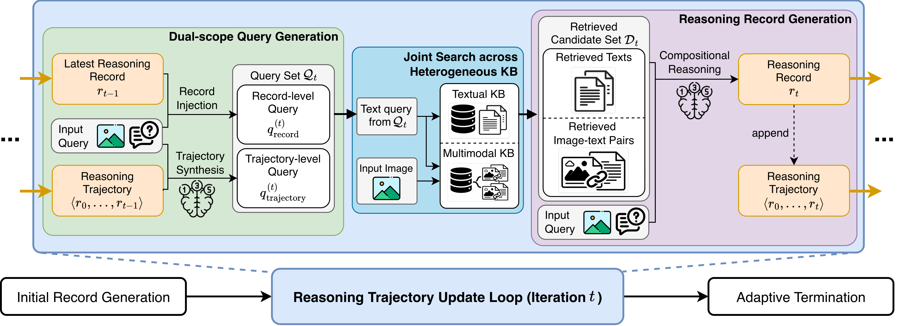

<div align="center">

# Progressive Multimodal Search and Reasoning for Knowledge-Intensive Visual Question Answering

**ACL 2026 Oral**

[](https://arxiv.org/abs/2509.00798)
[](https://arxiv.org/pdf/2509.00798)

**Changin Choi, Wonseok Lee, Jungmin Ko, Wonjong Rhee**

</div>

## Overview

This is the official repository for **PMSR: Progressive Multimodal Search and Reasoning**, a **multimodal iterative RAG** framework accepted to **ACL 2026 Oral**.

Knowledge-intensive visual question answering requires models to connect image content with external knowledge. Existing multimodal RAG systems commonly rely on a single retrieval pass, which can miss necessary evidence and leave early reasoning errors uncorrected. PMSR addresses this limitation with multimodal iterative retrieval-augmented generation, progressively building a structured reasoning trajectory. At each step, the model generates dual-scope search queries from both the latest reasoning record and the accumulated trajectory, retrieves evidence from heterogeneous knowledge bases, and composes the evidence into a compact updated record.

## Method

<p align="center">
  
</p>

PMSR progressively constructs a structured reasoning trajectory to enhance knowledge acquisition and synthesis:

- **Compact reasoning trajectory**: PMSR maintains the reasoning state as a trajectory of compact records synthesized from retrieved evidence, then uses this trajectory to guide subsequent retrieval and reasoning.
- **Record-isolated updates**: each iteration synthesizes a new reasoning record solely from newly retrieved evidence, avoiding dependence on the full interaction history.
- **Dual-scope querying over heterogeneous KBs**: PMSR decouples the latest reasoning state from the overall trajectory to support both local retrieval refinement and trajectory-level reflection, retrieving complementary evidence from heterogeneous knowledge bases and synthesizing it through compositional reasoning.

## Repository Structure

```text
PMSR/
+-- assets/
+-- agents/
+-- api/
+-- data/
+-- eval/
+-- outputs/
+-- scripts/
+-- search/
+-- data.md
+-- KB.md
`-- README.md
```

## Data and Knowledge Bases

PMSR expects local benchmark data and FAISS knowledge bases prepared before evaluation.

- See [data.md](data.md) for dataset preparation instructions for InfoSeek, E-VQA, LiveVQA, FVQA, InfoSeek Human, and MMSearch.
- See [KB.md](KB.md) for Wikipedia image-text and text-only knowledge-base preparation.
- See [MCP.md](MCP.md) to expose PMSR text and multimodal retrieval as MCP tools for Codex.

The evaluation entry point reads any prepared PMSR JSONL file directly:

```bash
python eval/main.py \
  --data data/EVQA_test.jsonl \
  --model Qwen/Qwen3.5-9B \
  --api_base http://<host>:8004/ \
  --itercount 3 \
  --topk 10
```

Retrieved images are returned by default. For search-oriented benchmark runs that should search the PMSR KB without returning retrieved images, add `--without-image`.

To run PMSR with MLLM image-text retrieval, first set the MLLM embedding KB and endpoint in `.env`:

```bash
MLLM_EMBED_API_BASE=http://<host>:8013
MLLM_EMBED_MODEL=Qwen/Qwen3-VL-Embedding-2B
MLLM_KB=/path/to/wikipedia_mllm.index
MLLM_METADATA=/path/to/wikipedia_mllm_metadata.csv
```

Then run evaluation with MLLM fusion:

```bash
python eval/main.py \
  --data data/InfoSeek_val.jsonl \
  --output-dir outputs/infoseek_val \
  --model Qwen/Qwen3.5-9B \
  --api-base http://<host>:8004/ \
  --itercount 3 \
  --topk 10 \
  --pmsr-fusion mllm
```

## Search-Oriented Benchmarks

For FVQA, MMSearch, LiveVQA, and the InfoSeek Human 2K subset, use Ollama web search for text retrieval instead of the local text FAISS KB. Cache Google Image Search results first, then pass the cached JSONL to evaluation.

Set the web-search credentials in `.env` or export them in your shell:

```bash
OLLAMA_API_KEY=<your_ollama_api_key>
SCRAPINGDOG_API_KEY=<your_scrapingdog_api_key>
```

Cache Google Image Search results into the PMSR `searched_results.google_image` schema:

```bash
python scripts/cache_google_image_search.py \
  --jsonl data/fvqa_test.jsonl \
  --output data/fvqa_test_pmsr_cache.jsonl \
  --mode fetch \
  --top-k 5
```

The cache script resumes by default when the output file already exists. Use `--limit 10` for a smoke test, or `--refresh` when you intentionally want to fetch results again for rows that already have cached image-search results.

Run PMSR with Ollama web search:

```bash
python eval/main.py \
  --data data/fvqa_test_pmsr_cache.jsonl \
  --output-dir outputs/fvqa_test \
  --model Qwen/Qwen3.5-9B \
  --api-base http://<host>:8004/ \
  --itercount 3 \
  --topk 10 \
  --web-search \
  --pmsr-fusion mllm \
  --without-image
```

Use the same cache-first pattern for the other open-web datasets:

```bash
python scripts/cache_google_image_search.py --jsonl data/MMSearch_end2end.jsonl --output data/MMSearch_end2end_pmsr_cache.jsonl --mode fetch --top-k 5
python scripts/cache_google_image_search.py --jsonl data/LiveVQA_test.jsonl --output data/LiveVQA_test_pmsr_cache.jsonl --mode fetch --top-k 5
python scripts/cache_google_image_search.py --jsonl data/InfoSeek_human_2k.jsonl --output data/InfoSeek_human_2k_pmsr_cache.jsonl --mode fetch --top-k 5
```

Then evaluate each cached file with `--web-search`. This flag overrides `TEXT_KB` from `.env`, so these runs use live web search for text evidence while still using the cached Google Image Search results and the configured PMSR or MLLM image-text retriever.

## ReACT with PMSR

`eval/main_react.py` exposes a single model-facing tool, `pmsr_search`. The model plans step-by-step dual-scope queries, while the tool backend can use the PMSR KB, web search, or Google Lens depending on the flags:

```bash
python eval/main_react.py \
  --data data/InfoSeek_val.jsonl \
  --model Qwen/Qwen3.5-9B \
  --api-base http://<host>:8004/ \
  --topk 10 \
  --pmsr-fusion mllm
```

Add `--web-search` to use Ollama web search as text evidence inside `pmsr_search`, and add `--google-lens-search` to use Google Lens image evidence inside the same tool.

## Citation

If you find PMSR useful for your research, please cite our paper:

```bibtex
@article{choi2025progressive,
  title   = {Progressive Multimodal Search and Reasoning for Knowledge-Intensive Visual Question Answering},
  author  = {Choi, Changin and Lee, Wonseok and Ko, Jungmin and Rhee, Wonjong},
  journal = {arXiv preprint arXiv:2509.00798},
  year    = {2025}
}
```

## Acknowledgements

We thank the authors and maintainers of the datasets, benchmarks, retrieval systems, and multimodal models used in this work, including Encyclopedic-VQA, InfoSeek, OK-VQA, FVQA, MMSearch, LiveVQA, Qwen-VL, SigLIP2, E5, FlashRAG, and related multimodal RAG and search-agent repositories.
